# BlogD - Minimal Blogging App ✍️

A clean and practical **Blogging Application** built with **Flutter**, **Firebase Auth**, **Cloud Firestore**, **Firebase Storage**, and **Provider** for state management.  
The app allows users to register/login, create and manage blogs with cover images, and read posts from others in a clean, responsive interface.

---

## Features 🚀

- **Authentication** 🔑  
  - Sign up & login with **email/password** or **phone number (OTP)**.  
  - Secure authentication via Firebase Auth.

- **Blog Management** 📝  
  - Create new blogs with a title, content, and cover image.  
  - Edit or delete blogs you own.  
  - View blogs in a simple, scrollable feed.  
  - Each blog displays author info, cover image, title, and published date.
  - Real-time updates via Firestore. 

- **Read Blogs** 📖  
  - Explore blogs written by other users.  
  - Responsive design for a clean reading experience.

- **Search Blogs** 🔍  
  - Search blogs by title directly from the feed.  
  - Clear search with a single tap.

- **Profile & Ownership** 👤  
  - Only blog owners can edit or delete their own posts.  
  - Profile-based authentication ensures data security.

---

## 📸 Screenshots

### **Landing Screen**
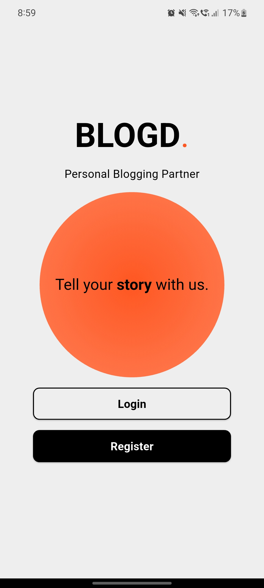

### **Login Screen**
> Users can log in via email/password or phone number.
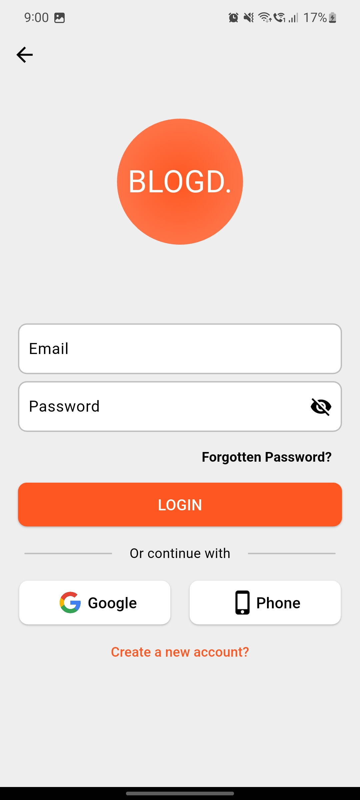

### **Login / Signup via Phone OTP**

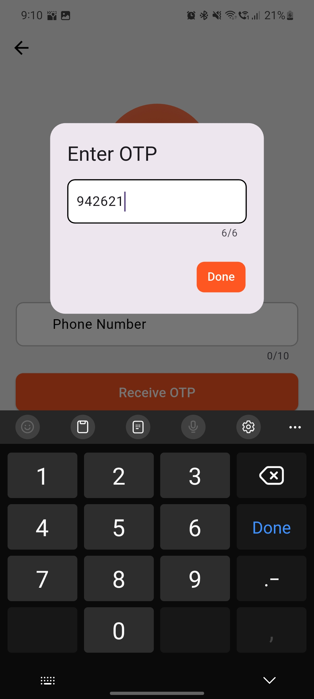

### **Signup Screen**
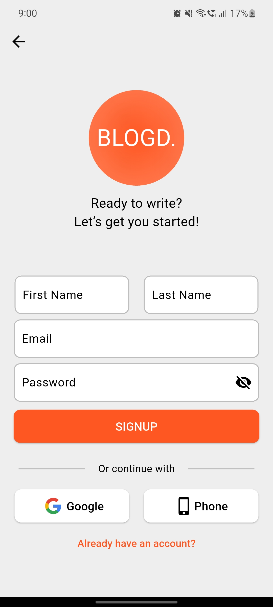
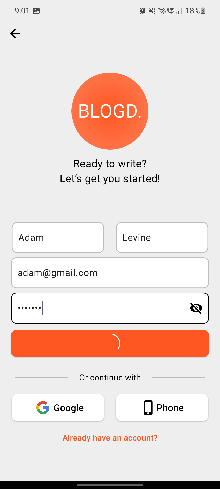
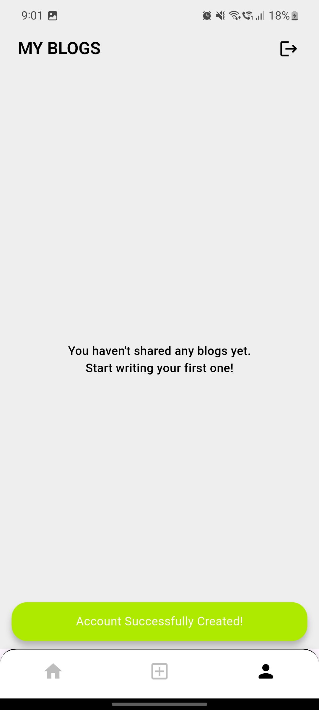


### **Blog Feed**
> Scroll through blogs posted by all users.
<p>
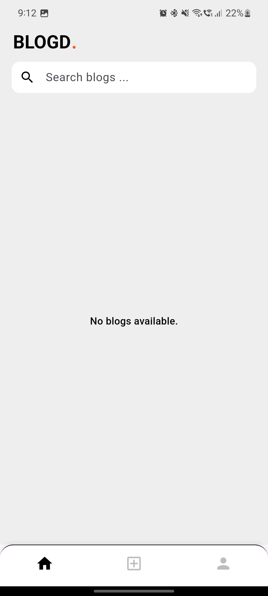
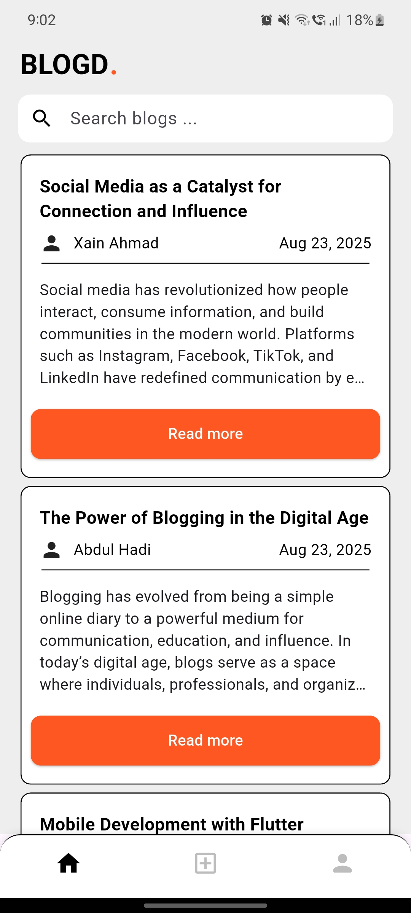
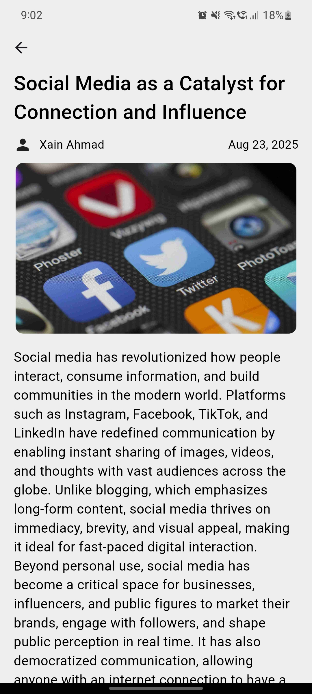
</p>

### **Create Blog**
> Add a new blog post with title, content, and cover image.
<p>
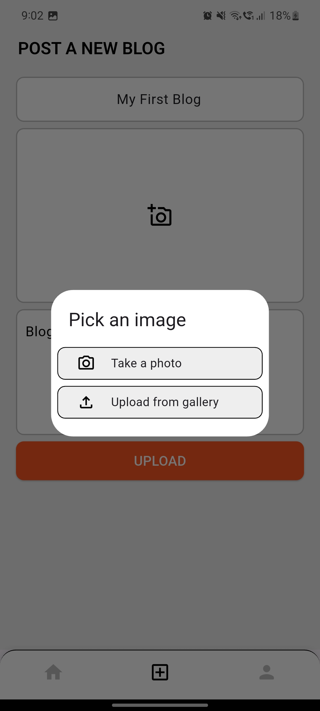

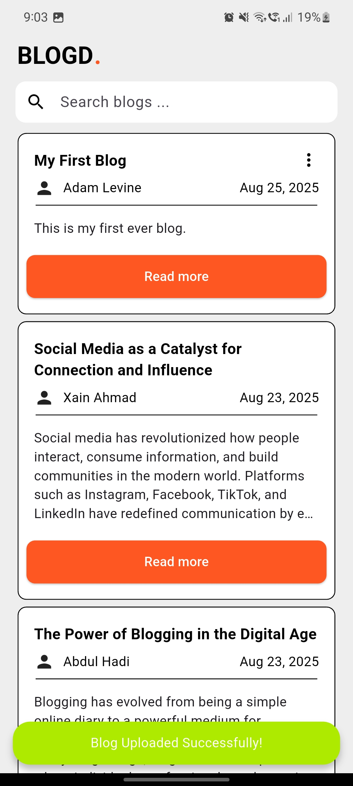

</p>

### **Edit / Delete Blog**
> Blog owners can edit or delete their own blogs.
<p>
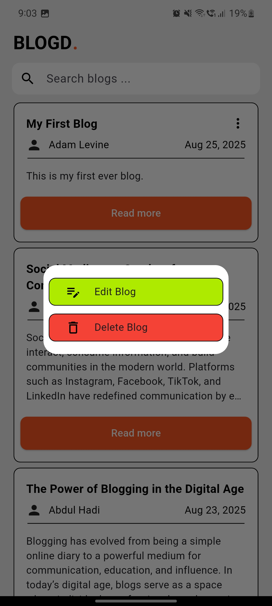
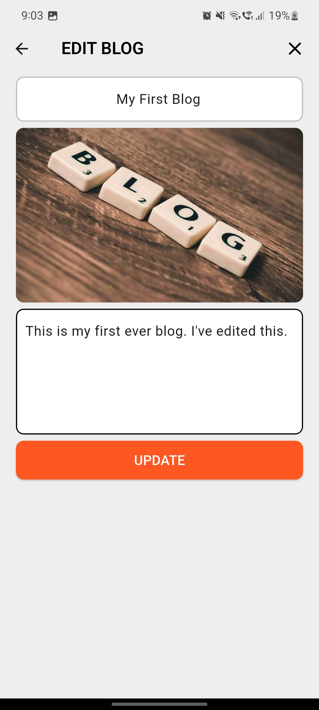
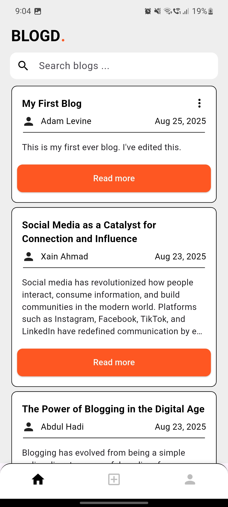
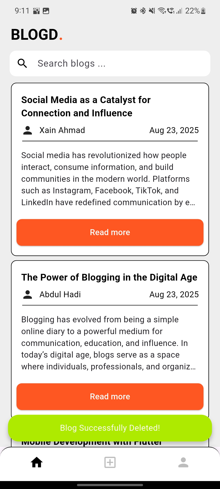
</p>

### **Search Blog by Title**
> Users can search for blogs by their title.
<p>
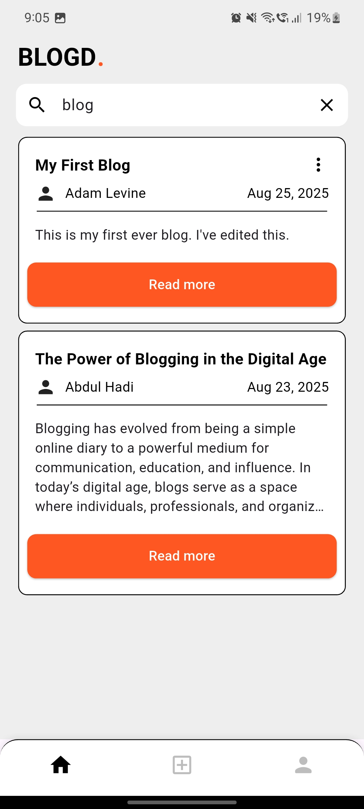
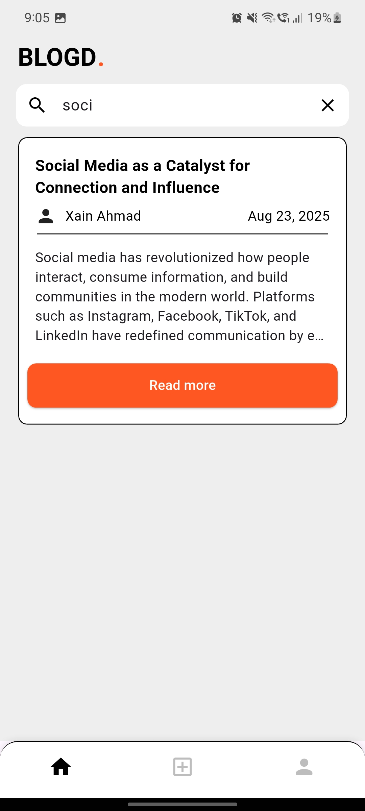
</p>

### **Profile Screen**
> Blog owners can view their blogs here, and edit or delete them.
<p>

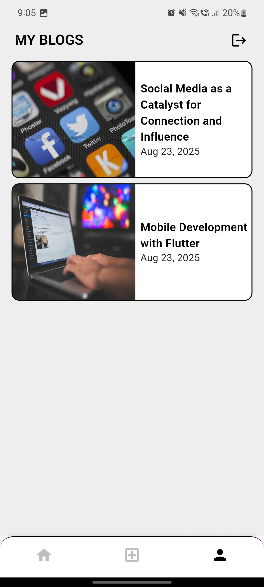
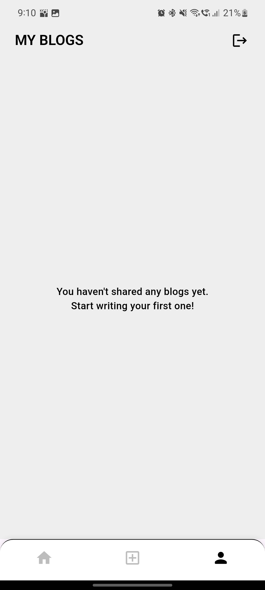
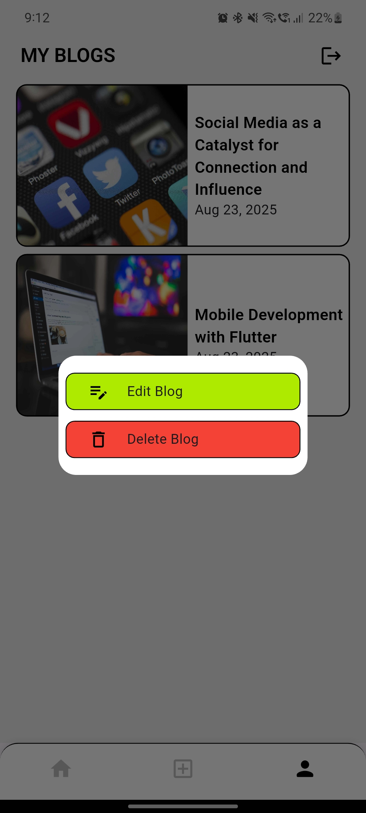
</p>

### **Signout**
> Users can signout by simply tapping on the button in the profile screen.
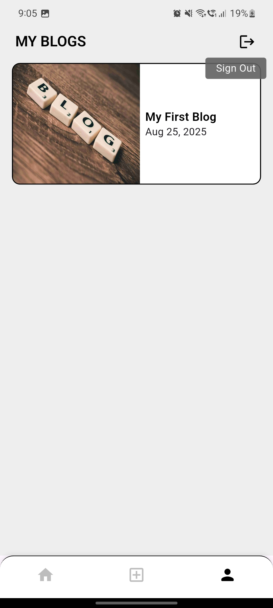
---

## Dependencies 📦

This project uses the following dependencies:

- [`firebase_core`](https://pub.dev/packages/firebase_core) – Initialize and configure Firebase.  
- [`firebase_auth`](https://pub.dev/packages/firebase_auth) – Firebase Authentication for email/password & phone login.  
- [`cloud_firestore`](https://pub.dev/packages/cloud_firestore) – Store and retrieve blogs and user data.  
- [`firebase_storage`](https://pub.dev/packages/firebase_storage) – Upload and manage cover images.  
- [`provider`](https://pub.dev/packages/provider) – State management.  
- [`image_picker`](https://pub.dev/packages/image_picker) – Select images from gallery or camera.  
- [`intl`](https://pub.dev/packages/intl) – Date formatting.  
- [`uuid`](https://pub.dev/packages/uuid) – Generate unique IDs for blogs.  
- [`flutter_dotenv`](https://pub.dev/packages/flutter_dotenv) – Environment variable management.  
---

##  Tech Stack 🛠️

- **Flutter** – Cross-platform UI toolkit.  
- **Dart** – Programming language for Flutter.  
- **Firebase Authentication** – User sign-up/login.  
- **Cloud Firestore** – Database for blogs and user info.  
- **Firebase Storage** – Media storage for cover images.  
- **Provider** – State management solution.  
- **VS Code / Android Studio** – IDEs.  
- **Git** – Version control.  

---

## Setup Instructions ⚙️

### Firebase Setup

1. Go to [Firebase Console](https://console.firebase.google.com) and create a project.  
2. Enable **Email/Password** and **Phone** under **Authentication → Sign-in method**.  
3. Enable **Cloud Firestore** in Build > Firestore Database.  
4. Enable **Storage** in Build > Storage.  
5. Add your Android/iOS app and download `google-services.json` or `GoogleService-Info.plist`.  
6. Place the config file in your app's respective folder.  

### Clone and Run
```bash
git clone https://github.com/yourusername/blogging_app_flutter.git
cd blogging_app_flutter
flutter pub get
flutter run
```

## License 📄
This project is licensed under the [MIT License](LICENSE).